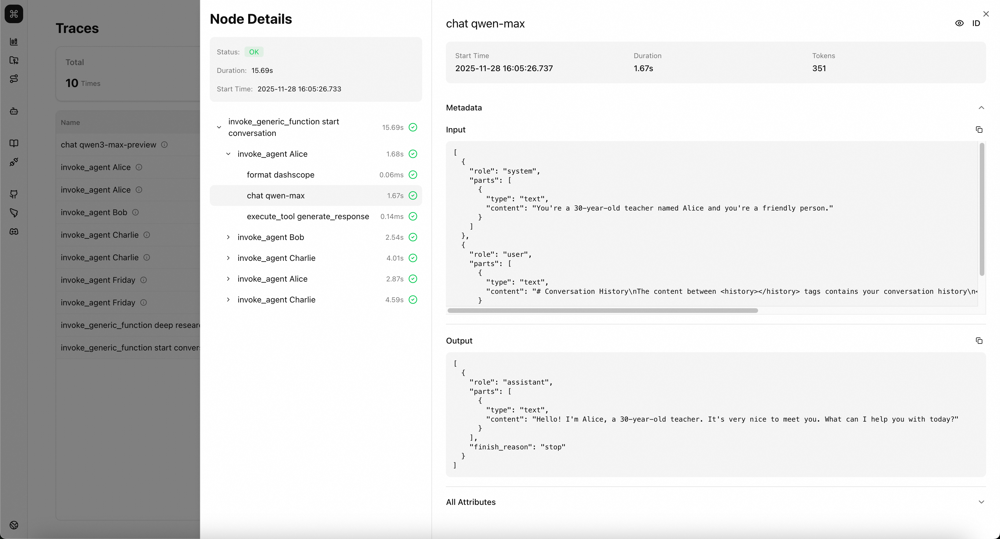
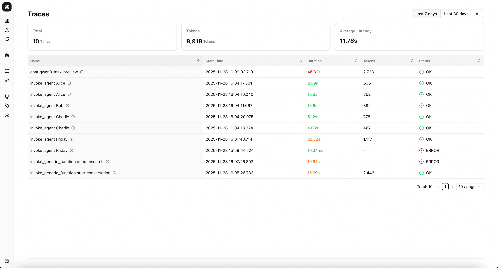
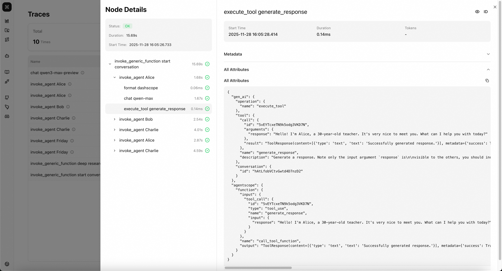

# 可观测性与链路追踪

AgentScope Studio 为 AI 应用提供了简单易用的可观测性与链路追踪能力。它可以帮助使用者快速了解到 AI 应用中的各种重要的时间和信息，如输入、输出、工具调用情况、执行耗时、错误、成本花销等。

AgentScope Studio 的可观测性基于 OpenTelemetry 语义规范和 OTLP 数据协议构建，它不仅可以开箱即用地接收和存储 AgentScope 上报的各种可观测信息，还支持任意的基于 OpenTelemetry 或 LoongSuite 的采集工具/AI 应用框架上报的数据的集成。



作为 AI 应用开发者，您可以：

- 快速实现开发与调试，了解上下文的产生、组织与传递
- 捕获评估需要的基本数据
- 定位应用中的错误和异常
- 优化调用耗时
- 追踪模型调用花销，辅助优化成本

作为可观测性组件开发者，您可以：

- 轻松部署 AI 可观测可视化工具
- 快速验证可观测性数据语义规范性
- 扩展开发为生产可用的可观测服务端

## 页面介绍与核心功能

您可以在 Studio 左侧工具栏中找到 Trace 页面的入口。

### 概览页面

在本页面，您可以看到过去一段时间所有上报到 Studio 的链路数据的基本信息。调用数、总 token 消耗以及平均耗时等关键指标会被聚合并展示在概览页面。

> 💡 **提示**：将鼠标移动到链路名称后面的图标上可以查看到该条链路的基本元信息，如 Trace ID。



### 详情页面

单击概览页面中的任意一条链路，您可以在左侧查看这条链路的调用顺序与调用关系。进一步点选不同层级的调用，您可以看到这些调用发生时详细的上下文。

在 Metadata 区域，您能够看到调用的输入和输出。对于 AI 相关的调用，如 LLM、Agent 等，输入输出会按照 OpenTelemetry 语义规范定义的[结构](https://opentelemetry.io/docs/specs/semconv/gen-ai/gen-ai-spans/#recording-content-on-attributes)进行展示。对于常规调用，如 Function、Format 等，输入输出会遵循 AgentScope 扩展[语义规范](#agentscope-扩展规范)展示。


在 All Attributes 区域，您能够看到本次调用的所有关键的元信息，命名遵循[语义规范](#语义规范)。



## 语义规范

AgentScope Studio 的可观测性数据遵循基于 [OpenTelemetry](#opentelemetry-generative-ai) 的语义规范。遵循该语义规范的数据会在 Studio 中得到更加准确、清晰的处理与展示。为了您可以更便捷地使用 Studio，有必要尽可能保证您的语义规范遵循本文中的约定。

> 💡 **提示**：AgentScope 库原生的可观测能力已经遵循该语义规范。即便您其他来源的可观测数据暂不遵循该语义规范，依然可以正常展示链路数据，但部分关键信息可能无法高亮/专门展示。

### OpenTelemetry Generative AI

OpenTelemetry 面向 Generative AI 类应用的可观测数据提供了一组语义规范标准，详细定义参见 [Semantic conventions for generative client AI spans](https://opentelemetry.io/docs/specs/semconv/gen-ai/gen-ai-spans/) 与 [Semantic Conventions for GenAI agent and framework spans](https://opentelemetry.io/docs/specs/semconv/gen-ai/gen-ai-agent-spans/)。

> 💡 **提示**：Studio 当前遵循的 OpenTelemetry 语义规范版本为 1.38.0。

当前遵循的语义规范包括：

- [**Inference**](https://opentelemetry.io/docs/specs/semconv/gen-ai/gen-ai-spans/#inference): model 调用
- [**Invoke agent span**](https://opentelemetry.io/docs/specs/semconv/gen-ai/gen-ai-agent-spans/#invoke-agent-span): agent 调用
- [**Execute tool span**](https://opentelemetry.io/docs/specs/semconv/gen-ai/gen-ai-spans/#execute-tool-span): toolkit 调用

### AgentScope 扩展规范

除定义在 OpenTelemetry 中的各种语义规范外，为了更清晰地展示调用过程，AgentScope 对一些特定的调用过程进行了语义规范的扩展。

#### Common 调用

适用于 AI 应用中发生的所有关键调用过程。

| Key | [Requirement Level](https://opentelemetry.io/docs/specs/semconv/general/attribute-requirement-level/) | Value Type | Description | Example Values |
|---|---|---|---|---|
| `agentscope.function.name` | `Recommended` | string | 调用的方法/函数名。 | `DashScopeChatModel.__call__`; `ToolKit.callTool` |
| `agentscope.function.input` | `Opt-In` | string | 方法/函数的输入。[1] | {<br/>&nbsp;&nbsp;"tool_call": {<br/>&nbsp;&nbsp;&nbsp;&nbsp;"type": "tool_use",<br/>&nbsp;&nbsp;&nbsp;&nbsp;"id": "call_83fce0d1d2684545a13649",<br/>&nbsp;&nbsp;&nbsp;&nbsp;"name": "multiply",<br/>&nbsp;&nbsp;&nbsp;&nbsp;"input": {<br/>&nbsp;&nbsp;&nbsp;&nbsp;&nbsp;&nbsp;"a": 5,<br/>&nbsp;&nbsp;&nbsp;&nbsp;&nbsp;&nbsp;"b": 3<br/>&nbsp;&nbsp;&nbsp;&nbsp;}<br/>&nbsp;&nbsp;}<br/>} |
| `agentscope.function.output` | `Opt-In` | string | 方法/函数的返回值。[2] | `ToolResponse(content=[{'type': 'text', 'text': '5 × 3 = 15'}], metadata=None, stream=False, is_last=True, is_interrupted=False, id='2025-11-28 00:38:52.733_cc4ead')` |

**[1] `agentscope.function.input`**: 方法/函数入参。**需要**按照 JSON 的格式序列化。

**[2] `agentscope.function.output`**: 方法/函数的返回值。按照 JSON 或 toString 的方式序列化。

#### Format 调用

该 span 代表发起 model 调用前对请求的准备和格式化过程。在 AgentScope 中，该方法对应 Formatter 工具的调用。

`gen_ai.operation.name` **应该**为`format`。

**Span 名称应该**为`format {agentscope.format.target}`。

**Span kind 应该**为`INTERNAL`。

**Span status 应该**遵循[记录错误](https://opentelemetry.io/docs/specs/semconv/general/recording-errors/)文档。

**Attributes:**

| Key | [Requirement Level](https://opentelemetry.io/docs/specs/semconv/general/attribute-requirement-level/) | Value Type | Description | Example Values |
|---|---|---|---|---|
| `gen_ai.operation.name` | `Required` | string | 正在执行的操作的名称。 | `chat`; `generate_content`; `text_completion` |
| `error.type` | `Conditionally Required` if the operation ended in an error | string | 操作中止时抛出的错误。 | `timeout`; `java.net.UnknownHostException`; `server_certificate_invalid`; `500` |
| `agentscope.format.target` | `Required` | string | 格式化要转为的目标类型。 | `dashscope`; `openai` |
| `agentscope.format.count` | `Required` | string | 实际被格式化的消息数量。[1] | `3` |
| `agentscope.function.name` | `Recommended` | string | 调用的方法/函数名。 | `DashScopeChatModel.__call__`; `ToolKit.callTool` |
| `agentscope.function.input` | `Opt-In` | string | 方法/函数的输入。[2] | {<br/>&nbsp;&nbsp;"tool_call": {<br/>&nbsp;&nbsp;&nbsp;&nbsp;"type": "tool_use",<br/>&nbsp;&nbsp;&nbsp;&nbsp;"id": "call_83fce0d1d2684545a13649",<br/>&nbsp;&nbsp;&nbsp;&nbsp;"name": "multiply",<br/>&nbsp;&nbsp;&nbsp;&nbsp;"input": {<br/>&nbsp;&nbsp;&nbsp;&nbsp;&nbsp;&nbsp;"a": 5,<br/>&nbsp;&nbsp;&nbsp;&nbsp;&nbsp;&nbsp;"b": 3<br/>&nbsp;&nbsp;&nbsp;&nbsp;}<br/>&nbsp;&nbsp;}<br/>} |
| `agentscope.function.output` | `Opt-In` | string | 方法/函数的返回值。[3] | `ToolResponse(content=[{'type': 'text', 'text': '5 × 3 = 15'}], metadata=None, stream=False, is_last=True, is_interrupted=False, id='2025-11-28 00:38:52.733_cc4ead')` |

**[1] `agentscope.format.count`**: 实际被格式化的消息数量。取值与格式化函数执行后返回的消息列表大小一致，如果在格式化过程中进行了截断或消息裁剪，则该取值可能小于传入的消息列表大小。

**[2] `agentscope.function.input`**: 方法/函数入参。**需要**按照 JSON 的格式序列化。

**[3] `agentscope.function.output`**: 方法/函数的返回值。按照 JSON 或 toString 的方式序列化。


#### Function 调用

该 span 代表发起一次任意的关键调用的过程。在 AgentScope 中，该方法对应常规函数的执行过程，当且仅当使用者通过 AgentScope 提供的方式为方法/函数添加链路追踪能力时生效。

`gen_ai.operation.name` **应该**为`invoke_generic_function`。

**Span 名称应该**为`invoke_generic_function {agentscope.function.name}`。

**Span kind 应该**为`INTERNAL`。

**Span status 应该**遵循[记录错误](https://opentelemetry.io/docs/specs/semconv/general/recording-errors/)文档。

**Attributes:**

| Key | [Requirement Level](https://opentelemetry.io/docs/specs/semconv/general/attribute-requirement-level/) | Value Type | Description | Example Values |
|---|---|---|---|---|
| `gen_ai.operation.name` | `Required` | string | 正在执行的操作的名称。 | `chat`; `generate_content`; `text_completion` |
| `error.type` | `Conditionally Required` if the operation ended in an error | string | 操作中止时抛出的错误。 | `timeout`; `java.net.UnknownHostException`; `server_certificate_invalid`; `500` |
| `agentscope.function.name` | `Recommended` | string | 调用的方法/函数名。 | `DashScopeChatModel.__call__`; `ToolKit.callTool` |
| `agentscope.function.input` | `Opt-In` | string | 方法/函数的输入。[1] | {<br/>&nbsp;&nbsp;"tool_call": {<br/>&nbsp;&nbsp;&nbsp;&nbsp;"type": "tool_use",<br/>&nbsp;&nbsp;&nbsp;&nbsp;"id": "call_83fce0d1d2684545a13649",<br/>&nbsp;&nbsp;&nbsp;&nbsp;"name": "multiply",<br/>&nbsp;&nbsp;&nbsp;&nbsp;"input": {<br/>&nbsp;&nbsp;&nbsp;&nbsp;&nbsp;&nbsp;"a": 5,<br/>&nbsp;&nbsp;&nbsp;&nbsp;&nbsp;&nbsp;"b": 3<br/>&nbsp;&nbsp;&nbsp;&nbsp;}<br/>&nbsp;&nbsp;}<br/>} |
| `agentscope.function.output` | `Opt-In` | string | 方法/函数的返回值。[2] | `ToolResponse(content=[{'type': 'text', 'text': '5 × 3 = 15'}], metadata=None, stream=False, is_last=True, is_interrupted=False, id='2025-11-28 00:38:52.733_cc4ead')` |

**[1] `agentscope.function.input`**: 方法/函数入参。**需要**按照 JSON 的格式序列化。

**[2] `agentscope.function.output`**: 方法/函数的返回值。按照 JSON 或 toString 的方式序列化。

## 集成

AgentScope Studio 提供 [OpenTelemetry 协议(OTLP)](https://opentelemetry.io/docs/specs/otlp/) 规范的服务。

默认情况下，AgentScope Studio 启动后，会暴露以下服务端点：

- **OTLP/Trace/gRPC**: `localhost:4317`，您可以通过修改 `OTEL_GRPC_PORT` 环境变量来调整 gRPC 的服务端点。
- **OTLP/Trace/HTTP**: `localhost:3000`，您可以通过修改 `PORT` 环境变量来调整 HTTP 的服务端点。

> 💡 **提示**：当前 Studio 仅支持接收 Trace 类型数据。

### AgentScope 应用集成

AgentScope 框架原生支持了 Trace 数据的采集与导出，您可以在应用中增加一些额外的代码实现 Trace 数据的上报。

#### AgentScope Python 应用

在您的应用代码前增加以下初始化代码。

```python
import agentscope

agentscope.init(studio_url="http://localhost:3000") # 将此处替换为 Studio 的 HTTP 服务端点

# your application code
```

#### AgentScope Java 应用

1. 在您的项目中引入连接 Studio 所需的依赖。

maven:

```xml
<depenedency>
  <groupId>io.agentscope</groupId>
  <artifactId>agentscope-extensions-studio</artifactId>
</depencency>
```

gradle:

```gradle
implementation("io.agentscope:agentscope-extensions-studio")
```

2. 在您的应用代码前增加以下初始化代码。

```Java
public static void main() {
  StudioManager.init()
    .studioUrl("http://localhost:3000")
    .initialize()
    .block();

  // your application code
}
```

### LoongSuite/OpenTelemetry 探针集成

LoongSuite 探针是阿里云云原生团队基于 OpenTelemetry 探针研发的，面向多语言 AI 应用的无侵入可观测数据采集工具。这些探针通过编译时/运行时代码增强的机制，通过对应用代码完成代码插桩实现无侵入的可观测性。

LoongSuite 探针和 OpenTelemetry 探针所采集的数据均使用 OTLP Exportor 进行导出，因此可以直接被 AgentScope Studio 接收和存储。当前支持的探针包括：

- [LoongSuite Python Agent](https://github.com/alibaba/loongsuite-python-agent)
- [LoongSuite Go Agent](https://github.com/alibaba/loongsuite-go-agent)
- [LoongSuite Java Agent](https://github.com/alibaba/loongsuite-java-agent)
- [OpenTelemetry Python Agent](https://github.com/open-telemetry/opentelemetry-python-contrib)
- [OpenTelemetry Java Agent](https://github.com/open-telemetry/opentelemetry-java-instrumentation)
- [OpenTelemetry JavaScript Agent](https://github.com/open-telemetry/opentelemetry-js-contrib)
- ...(其他任何支持的 OTLP Exporter 的数据采集器)

#### LoongSuite Python 探针集成

1. 参考 [LoongSuite Python 探针官方文档](https://github.com/alibaba/loongsuite-python-agent/tree/main/instrumentation-loongsuite/loongsuite-instrumentation-agentscope)，安装探针
2. 修改启动参数，将数据导出到 AgentScope Studio，请将 `exporter_otlp_endpoint` 替换为您 Studio 的 gRPC 服务地址

```shell
loongsuite-instrument \
    --traces_exporter otlp \
    --metrics_exporter console \
    --service_name your-service-name \
    --exporter_otlp_endpoint 0.0.0.0:4317 \
    python myapp.py
```

#### OpenTelemetry Java 探针集成

1. 参考 [OpenTelemetry Java 探针官方文档](https://github.com/open-telemetry/opentelemetry-java-instrumentation)，安装探针
2. 修改启动参数，将数据导出到 AgentScope Studio，请将 `otel.exporter.otlp.traces.endpoint` 替换为您 Studio 的 gRPC 服务地址

```shell
java -javaagent:path/to/opentelemetry-javaagent.jar \
     -Dotel.resource.attributes=service.name=your-service-name \
     -Dotel.traces.exporter=otlp \
     -Dotel.metrics.exporter=console \
     -Dotel.exporter.otlp.traces.endpoint=http://localhost:4317 \
     -jar myapp.jar
```

### 高级集成：导入自定义链路数据

如果您需要将任意来源的可观测数据作为链路数据导出到 AgentScope Studio，可以参照 [OTLP 协议](https://opentelemetry.io/docs/specs/otlp/)对数据进行组装。AgentScope Studio 接收 Protobuf 格式编码的链路数据，并同时提供 HTTP 和 gRPC 服务，服务暴露方式分别遵循 [OTLP/HTTP](https://github.com/open-telemetry/opentelemetry-proto/blob/main/opentelemetry/proto/collector/trace/v1/trace_service_http.yaml) 和 [OTLP/gRPC](https://github.com/open-telemetry/opentelemetry-proto/blob/main/opentelemetry/proto/collector/trace/v1/trace_service.proto) 约定，数据体遵循 [OTLP Protobuf](https://github.com/open-telemetry/opentelemetry-proto/blob/main/opentelemetry/proto/trace/v1/trace.proto) 定义。

#### 使用 OTLP Exporter 导出数据

为保证数据正确性，强烈建议您使用 OTLP Exporter 进行数据导出。您可以在 [OTLP 官方文档](https://opentelemetry.io/docs/specs/otel/protocol/exporter/)中找到更详细的教程。以下是 Python 语言的 OTLP Exporter 示例:

> 💡 **提示**：本节部分参考自 [OpenTelemetry Python API](https://opentelemetry-python.readthedocs.io/en/latest/exporter/otlp/otlp.html)。

创建 OTLP Exporter 并初始化 TracerProvider：

```Python
from opentelemetry.sdk.trace import TracerProvider
from opentelemetry.sdk.trace.export import BatchSpanProcessor
from opentelemetry.exporter.otlp.proto.http.trace_exporter import (
    OTLPSpanExporter,
)

tracer_provider = TracerProvider()
# OTLP/HTTP for OpenTelemetry Python SDK by default
exporter = OTLPSpanExporter(endpoint="http://localhost:3000")
span_processor = BatchSpanProcessor(exporter)
tracer_provider.add_span_processor(span_processor)
```

使用 TracerProvider 创建 Tracer 并构建 Span：

```Python
# create tracer
tracer = tracer_provider.get_tracer("test_module", "1.0.0")

# create span
# attributes maybe set here
with tracer.start_as_current_span("test") as span:
    try:
        # do something
        # attributes may be set here
        span.set_attributes({"test_key": "test_value"})
        span.set_status(trace_api.StatusCode.OK)
        span.end()
        return res

    except Exception as e:
        span.set_status(
            trace_api.StatusCode.ERROR,
            str(e),
        )
        span.record_exception(e)
        # end span even exception is raised
        span.end()
        raise e from None
```
